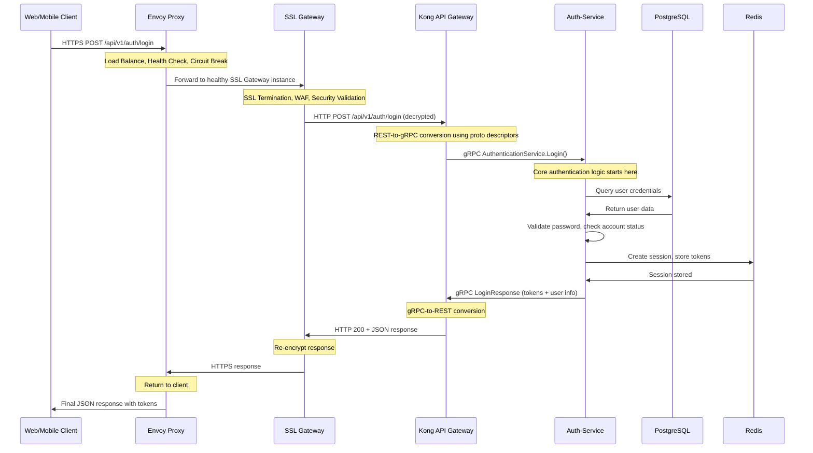

# 🔐 AUTH-SERVICE IMPLEMENTATION GUIDE

## 🌊 **COMPLETE REQUEST JOURNEY**

Understanding how authentication requests travel through your 4-layer architecture before reaching the auth-service:

### **Full Request Flow: Client → Envoy → SSL Gateway → Kong → Auth-Service**



### **What Each Layer Handles (So You Don't Have To):**

**🔹 Envoy Proxy**: Traffic distribution, health monitoring, circuit breaking  
**🔹 SSL Gateway**: HTTPS termination, certificate management, WAF protection  
**🔹 Kong**: REST-to-gRPC conversion, API management, rate limiting  
**🔹 Auth-Service**: **YOUR FOCUS** - Pure authentication business logic  

---

## 🎯 **AUTH-SERVICE: YOUR PURE RESPONSIBILITY**

Your auth-service receives **clean gRPC calls** and focuses solely on:

### **Core Authentication Logic**
- Validate user credentials against database
- Check account status (locked, verified, active)
- Generate JWT access and refresh tokens
- Manage user sessions in Redis
- Handle password policies and security rules

### **What You DON'T Handle**
- ❌ SSL/TLS encryption (SSL Gateway does this)
- ❌ REST API endpoints (Kong converts REST to gRPC)
- ❌ Rate limiting (Kong handles this)
- ❌ Load balancing (Envoy handles this)
- ❌ CORS headers (Kong handles this)

### **What You DO Handle**
- ✅ User password validation
- ✅ JWT token generation and validation  
- ✅ Session management with Redis
- ✅ Account security (lockouts, attempts)
- ✅ Role and permission checking
- ✅ OAuth2 integration logic

---

## 📡 **gRPC SERVICES YOU MUST IMPLEMENT**

Kong will call these gRPC services on your auth-service:

### **1. AuthenticationService**
```protobuf
service AuthenticationService {
  rpc Login(LoginRequest) returns (LoginResponse);
  rpc Register(RegisterRequest) returns (RegisterResponse);
  rpc RefreshToken(RefreshTokenRequest) returns (RefreshTokenResponse);
  rpc Logout(LogoutRequest) returns (LogoutResponse);
  rpc ChangePassword(ChangePasswordRequest) returns (ChangePasswordResponse);
  rpc ForgotPassword(ForgotPasswordRequest) returns (ForgotPasswordResponse);
  rpc ResetPassword(ResetPasswordRequest) returns (ResetPasswordResponse);
  rpc VerifyEmail(VerifyEmailRequest) returns (VerifyEmailResponse);
}
```

### **2. TokenValidationService** 
```protobuf
service TokenValidationService {
  rpc ValidateToken(TokenValidationRequest) returns (TokenValidationResponse);
  rpc GetUserFromToken(TokenValidationRequest) returns (UserDetailsResponse);
  rpc CheckPermission(PermissionCheckRequest) returns (PermissionCheckResponse);
  rpc RevokeToken(RevokeTokenRequest) returns (RevokeTokenResponse);
}
```

### **3. UserManagementService**
```protobuf
service UserManagementService {
  rpc GetUserProfile(GetUserRequest) returns (UserProfileResponse);
  rpc UpdateUserProfile(UpdateUserRequest) returns (UpdateUserResponse);
  rpc GetUserRoles(GetUserRequest) returns (UserRolesResponse);
  rpc UpdateUserRoles(UpdateUserRolesRequest) returns (UpdateUserRolesResponse);
  rpc ListActiveSessions(GetUserRequest) returns (ActiveSessionsResponse);
  rpc RevokeSession(RevokeSessionRequest) returns (RevokeSessionResponse);
}
```

**Key Point**: Kong translates REST requests into these gRPC calls automatically using your proto descriptor files.

---

## 🔒 **DETAILED AUTHENTICATION FUNCTIONALITY**

### **1. User Login Process**

**What Kong Sends You:**
- gRPC `Login(username, password, rememberMe, ipAddress, userAgent)`

**What You Must Do:**
1. **Database Lookup**: Find user by username/email
2. **Account Validation**: Check if account is verified, not locked, not deleted
3. **Password Verification**: Compare bcrypt hash with provided password
4. **Failed Attempt Handling**: Track failed login attempts, lock account if needed
5. **Session Creation**: Generate unique session ID, store in Redis
6. **Token Generation**: Create JWT access token (1h) and refresh token (30d)
7. **Audit Logging**: Log successful login with IP, timestamp, user agent
8. **Response**: Return tokens, user info, session details

**Security Considerations:**
- Rate limiting login attempts per IP (handled by Kong)
- Account lockout after 5 failed attempts (30 min lockout)
- Password complexity validation
- Time-based attack prevention
- Session hijacking protection

### **2. Token Validation (Most Critical)**

**What Other Services Send You:**
- gRPC `ValidateToken(token, requiredRoles, requiredPermissions)`

**What You Must Do:**
1. **JWT Verification**: Validate signature, expiration, issuer
2. **Session Check**: Verify session still active in Redis
3. **User Status**: Ensure user account still active/verified
4. **Role Validation**: Check if user has required roles
5. **Permission Check**: Verify specific permissions if requested
6. **Response**: Return user context (id, username, roles, permissions)

**Performance Requirements:**
- Sub-5ms response time (called frequently)
- Cache user roles/permissions in Redis
- Use JWT for stateless validation when possible

### **3. User Registration Process**

**What Kong Sends You:**
- gRPC `Register(username, email, password, confirmPassword)`

**What You Must Do:**
1. **Input Validation**: Username format, email validity, password strength
2. **Uniqueness Check**: Ensure username and email are unique
3. **Password Hashing**: Use bcrypt with salt rounds (12)
4. **User Creation**: Insert user record with unverified status
5. **Verification Email**: Generate token, send email via notification service
6. **Default Roles**: Assign default USER role
7. **Audit Logging**: Log registration attempt
8. **Response**: Return user ID, verification requirement status

### **4. Session Management**

**Session Data Structure (Redis):**
```
session:{sessionId} = {
  userId: 123,
  username: "john_doe",
  roles: ["USER"],
  permissions: ["PROBLEM_READ", "SUBMISSION_CREATE"],
  refreshTokenHash: "...",
  ipAddress: "192.168.1.1",
  userAgent: "Mozilla/5.0...",
  createdAt: "2025-09-12T10:30:00Z",
  lastAccessedAt: "2025-09-12T15:45:00Z",
  expiresAt: "2025-10-12T10:30:00Z"
}

user_sessions:{userId} = Set["session1", "session2", "session3"]
```

**Session Operations:**
- **Create Session**: On successful login
- **Update Last Access**: On token validation
- **Revoke Session**: On logout or security event
- **Cleanup Expired**: Background job every hour
- **Multi-Device Support**: Track multiple active sessions per user

### **5. OAuth2 Integration**

**Google OAuth2 Flow:**
1. **Authorization URL**: Generate Google OAuth2 URL with state parameter
2. **Callback Handling**: Receive authorization code from Google
3. **Token Exchange**: Exchange code for Google access token
4. **User Info**: Fetch user profile from Google API
5. **Account Linking**: Find existing user or create new one
6. **Session Creation**: Same as regular login
7. **Response**: Return platform tokens

**Account Linking Logic:**
- If email exists: Link OAuth account to existing user
- If new email: Create new user with OAuth provider info
- Store provider ID for future logins

### **6. Password Security**

**Password Requirements:**
- Minimum 8 characters
- At least 1 uppercase letter
- At least 1 lowercase letter  
- At least 1 number
- At least 1 special character
- Not common password (check against dictionary)
- Not similar to username or email

**Password Hashing:**
```
- Algorithm: bcrypt
- Salt Rounds: 12 (adjustable for performance)
- Store: password_hash in database
- Never store: plain text passwords anywhere
```

**Password Reset Process:**
1. Generate secure random token (32 bytes)
2. Store token hash with expiration (15 minutes)
3. Send reset email with token
4. Validate token on reset attempt
5. Update password hash
6. Invalidate all user sessions
7. Send password changed notification

---

## 🗄️ **DATABASE DESIGN**

### **Core Tables You Need:**

**Users Table:**
```sql
- id (PRIMARY KEY)
- username (UNIQUE, indexed)
- email (UNIQUE, indexed)
- password_hash
- email_verified (boolean)
- account_locked (boolean)
- failed_login_attempts (integer)
- locked_until (timestamp)
- oauth_provider (google, github, local)
- oauth_provider_id
- created_at, updated_at, last_login_at
```

**Roles & Permissions:**
```sql
- roles: id, name, description
- permissions: id, name, resource, action, description
- user_roles: user_id, role_id (many-to-many)
- role_permissions: role_id, permission_id (many-to-many)
```

**Password Reset Tokens:**
```sql
- id, user_id, token_hash, expires_at, used_at
```

**Email Verification:**
```sql
- id, user_id, token_hash, expires_at, verified_at
```

**Audit Logs:**
```sql
- id, user_id, action, ip_address, user_agent, success, created_at
```

---

## 🚀 **PERFORMANCE & SCALING CONSIDERATIONS**

### **High-Frequency Operations:**
1. **Token Validation**: 5,000+ requests/second
   - Cache user roles in Redis (5 min TTL)
   - Use JWT for stateless validation
   - Database read replicas for user lookups

2. **Session Lookups**: 1,000+ requests/second
   - Redis cluster for session storage
   - Connection pooling (50+ connections)
   - Async operations where possible

### **Caching Strategy:**
```
Redis Cache Keys:
- user:{userId} → User profile + roles (5 min TTL)
- user_permissions:{userId} → User permissions (10 min TTL)
- failed_attempts:{ip} → Login attempt tracking (1 hour TTL)
- email_verification:{token} → Verification tokens (15 min TTL)
- password_reset:{token} → Reset tokens (15 min TTL)
```

### **Database Optimization:**
- **Indexes**: username, email, oauth_provider + oauth_provider_id
- **Connection Pooling**: 20-50 connections per instance
- **Read Replicas**: For user lookups and validation
- **Query Optimization**: Use prepared statements, avoid N+1 queries

### **Monitoring Requirements:**
- **Login Success Rate**: Should be >95%
- **Token Validation Latency**: <5ms p95
- **Database Connection Pool**: Monitor usage
- **Redis Connection Pool**: Monitor usage
- **Failed Login Attempts**: Alert on spikes

---

## 🔧 **DEPLOYMENT & CONFIGURATION**

### **Environment Variables:**
```
# Database
DB_HOST=postgres-primary
DB_PORT=5432
DB_NAME=auth_db
DB_USERNAME=auth_user
DB_PASSWORD=secret

# Redis
REDIS_HOST=redis-cluster
REDIS_PORT=6379
REDIS_PASSWORD=secret

# JWT
JWT_PRIVATE_KEY_PATH=/secrets/jwt-private.key
JWT_PUBLIC_KEY_PATH=/secrets/jwt-public.key
JWT_ACCESS_TOKEN_TTL=3600
JWT_REFRESH_TOKEN_TTL=2592000

# OAuth2
GOOGLE_CLIENT_ID=your-client-id
GOOGLE_CLIENT_SECRET=your-secret
GOOGLE_REDIRECT_URI=https://api.yourplatform.com/oauth2/callback/google

# Security
PASSWORD_BCRYPT_ROUNDS=12
ACCOUNT_LOCKOUT_ATTEMPTS=5
ACCOUNT_LOCKOUT_DURATION=1800
```

### **Health Checks:**
```
# Health endpoints you should provide
/actuator/health → Overall service health
/actuator/health/database → Database connectivity
/actuator/health/redis → Redis connectivity
/actuator/health/external → OAuth2 providers
```

### **Resource Requirements:**
```
Minimum:
- CPU: 500m
- Memory: 512Mi
- Storage: 10Gi (logs)

Production:
- CPU: 1000m (with burst to 2000m)
- Memory: 1Gi (with limit 2Gi)
- Storage: 50Gi (logs + cache)
```

---

## 🎭 **USER JOURNEY SCENARIOS**

### **Scenario 1: New User Registration**
1. User submits registration form (handled by Kong → your service)
2. You validate input, create unverified user
3. You generate verification token, store in Redis
4. You call notification service to send verification email
5. User clicks email link (Kong → your VerifyEmail service)
6. You mark user as verified, create welcome session
7. You return success response

### **Scenario 2: Competitive Programming Contest Login Rush**
1. 1000+ users login within 15 minutes for contest
2. Your service handles concurrent login requests
3. Redis manages session storage efficiently
4. Database handles user lookups with read replicas
5. JWT tokens enable stateless validation
6. Other services validate tokens without calling you

### **Scenario 3: Security Incident Response**
1. Detect suspicious login pattern (multiple failed attempts)
2. Lock affected accounts automatically
3. Revoke all sessions for compromised users
4. Generate audit logs for investigation
5. Send security notifications to users
6. Coordinate with admin panel for manual review

---

This implementation guide focuses purely on what **your auth-service** needs to do, without worrying about the complexity handled by Envoy, SSL Gateway, or Kong. Your service receives clean gRPC calls and responds with authentication decisions and user context.
