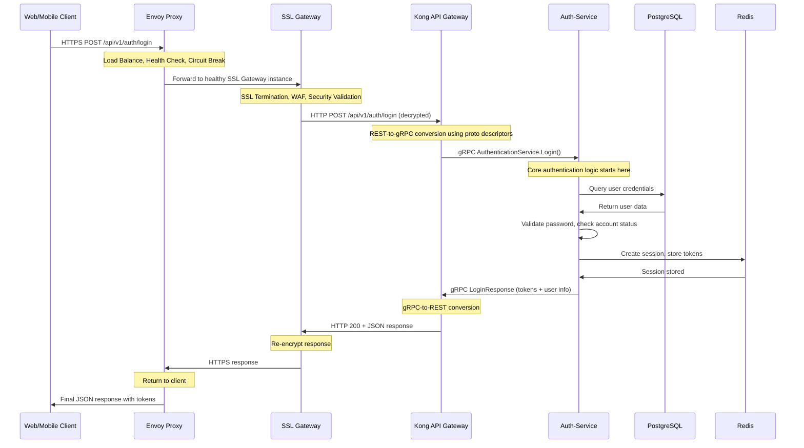

# 🔐 AUTH-SERVICE IMPLEMENTATION GUIDE
## 🌊 **REACTIVE WEBFLUX ARCHITECTURE**

**Key Implementation Approach:**
- **Reactive gRPC Services** with WebFlux backend for high-performance non-blocking I/O
- **JWT-based Authentication** with RS256 asymmetric signing (no server-side sessions)
- **Redis for Blacklisting Only** - logout and token revocation management
- **Refresh Token Strategy** - long-lived tokens for seamless user experience
- **Connection Pooling** - R2DBC for PostgreSQL, reactive Redis templates
- **Performance Target** - 5000+ token validations/second per instance

## 🌊 **COMPLETE REQUEST JOURNEY**

Understanding how authentication requests travel through your 4-layer architecture before reaching the auth-service:

### **Full Request Flow: Client → Envoy → SSL Gateway → Kong → Auth-Service**



### **What Each Layer Handles (So You Don't Have To):**

**🔹 Envoy Proxy**: Traffic distribution, health monitoring, circuit breaking  
**🔹 SSL Gateway**: HTTPS termination, certificate management, WAF protection  
**🔹 Kong**: REST-to-gRPC conversion, API management, rate limiting  
**🔹 Auth-Service**: **YOUR FOCUS** - Pure authentication business logic  

---

## 🎯 **AUTH-SERVICE: YOUR PURE RESPONSIBILITY**

Your auth-service receives **clean gRPC calls** and focuses solely on:

### **Core Authentication Logic (Reactive Implementation)**
- **Reactive User Validation** - Non-blocking database lookups with R2DBC
- **JWT Token Management** - RS256 asymmetric signing with cached public keys
- **Refresh Token Strategy** - Long-lived refresh tokens (30 days) for token renewal
- **Redis Blacklist Management** - Only for logout and token revocation
- **Reactive Session Handling** - Stateless JWT validation with minimal Redis usage
- **Performance Optimization** - Connection pooling, pre-compiled regex, parallel operations

### **What You DON'T Handle**
- ❌ SSL/TLS encryption (SSL Gateway does this)
- ❌ REST API endpoints (Kong converts REST to gRPC)
- ❌ Rate limiting (Kong handles this)
- ❌ Load balancing (Envoy handles this)
- ❌ CORS headers (Kong handles this)
- ❌ Server-side session storage (JWT handles state)

### **What You DO Handle**
- ✅ Reactive user password validation with bcrypt
- ✅ JWT access token (1h) and refresh token (30d) generation
- ✅ Token blacklist management in Redis (logout only)
- ✅ Account security (lockouts, failed attempts tracking)
- ✅ Role and permission validation
- ✅ OAuth2 integration with reactive HTTP clients

---

## 📡 **REACTIVE gRPC SERVICES IMPLEMENTATION**

Kong will call these reactive gRPC services on your auth-service:

### **1. AuthenticationService (Reactive Implementation)**
```protobuf
service AuthenticationService {
  rpc Login(LoginRequest) returns (LoginResponse);                    // Reactive: User lookup + JWT generation
  rpc Register(RegisterRequest) returns (RegisterResponse);           // Reactive: User creation + email verification  
  rpc RefreshToken(RefreshTokenRequest) returns (RefreshTokenResponse); // Reactive: Token refresh + blacklist check
  rpc Logout(LogoutRequest) returns (LogoutResponse);                 // Reactive: Token blacklisting in Redis
  rpc ChangePassword(ChangePasswordRequest) returns (ChangePasswordResponse); // Reactive: Password update + session invalidation
  rpc ForgotPassword(ForgotPasswordRequest) returns (ForgotPasswordResponse); // Reactive: Reset token generation
  rpc ResetPassword(ResetPasswordRequest) returns (ResetPasswordResponse);   // Reactive: Password reset + token cleanup
  rpc VerifyEmail(VerifyEmailRequest) returns (VerifyEmailResponse);  // Reactive: Email verification
}
  rpc ResetPassword(ResetPasswordRequest) returns (ResetPasswordResponse);
  rpc VerifyEmail(VerifyEmailRequest) returns (VerifyEmailResponse);
}
```

### **2. TokenValidationService (High-Performance Reactive)**
```protobuf
service TokenValidationService {
  rpc ValidateToken(TokenValidationRequest) returns (TokenValidationResponse);     // Reactive: JWT + blacklist check (5000+ req/sec)
  rpc GetUserFromToken(TokenValidationRequest) returns (UserDetailsResponse);     // Reactive: JWT parsing + user cache lookup
  rpc CheckPermission(PermissionCheckRequest) returns (PermissionCheckResponse);  // Reactive: Role/permission validation
  rpc RevokeToken(RevokeTokenRequest) returns (RevokeTokenResponse);             // Reactive: Add to Redis blacklist
}
```

### **3. UserManagementService (Reactive User Operations)**
```protobuf
service UserManagementService {
  rpc GetUserProfile(GetUserRequest) returns (UserProfileResponse);               // Reactive: User data with caching
  rpc UpdateUserProfile(UpdateUserRequest) returns (UpdateUserResponse);         // Reactive: Profile update + cache invalidation
  rpc GetUserRoles(GetUserRequest) returns (UserRolesResponse);                  // Reactive: Role lookup with Redis cache
  rpc UpdateUserRoles(UpdateUserRolesRequest) returns (UpdateUserRolesResponse); // Reactive: Role update + cache refresh
  rpc ListActiveSessions(GetUserRequest) returns (ActiveSessionsResponse);       // Reactive: JWT-based session listing
  rpc RevokeSession(RevokeSessionRequest) returns (RevokeSessionResponse);       // Reactive: Token blacklisting
}
```

**Implementation Note**: No REST Controllers needed - gRPC services handle all external requests through Kong's REST-to-gRPC conversion.

---

## 🔒 **REACTIVE JWT + REFRESH TOKEN STRATEGY**

### **1. JWT-Based Authentication (No Server Sessions)**

**Token Architecture:**
- **Access Token**: Short-lived (1 hour), contains user claims and permissions
- **Refresh Token**: Long-lived (30 days), used only for token renewal
- **Signing**: RS256 asymmetric encryption with cached public keys
- **Storage**: Stateless - no server-side session storage
- **Blacklist**: Redis-only for logout and revoked tokens

**Reactive Login Process:**
1. **User Validation**: Reactive database lookup with R2DBC
2. **Password Verification**: Parallel bcrypt validation on bounded elastic scheduler
3. **Token Generation**: Parallel access + refresh token creation
4. **Response**: Return both tokens (no session storage)

**Performance Optimizations:**
- Pre-compiled regex patterns for token validation
- Cached RSA public keys for signature verification
- Connection pooling for database and Redis operations
- Parallel token generation and user lookup operations

### **2. Token Refresh Strategy (High Performance)**

**Refresh Token Flow:**
1. **Blacklist Check**: Reactive Redis lookup for revoked refresh tokens
2. **JWT Validation**: Verify refresh token signature and expiration  
3. **User Status**: Quick reactive user status validation
4. **New Tokens**: Generate fresh access + refresh token pair
5. **Old Token Cleanup**: Add old refresh token to blacklist

**Redis Blacklist Structure:**
```
blacklist:refresh:{tokenId} = "revoked" (TTL: token expiration)
blacklist:access:{tokenId} = "revoked" (TTL: token expiration)
```

### **3. High-Performance Token Validation (5000+ req/sec)**

**Reactive Validation Chain:**
1. **JWT Parsing**: Extract claims without database lookup
2. **Blacklist Check**: Quick Redis reactive lookup for revoked tokens
3. **User Context**: Cached user roles and permissions (Redis TTL: 5 min)
4. **Permission Validation**: In-memory role-based permission checking
5. **Response**: User context with roles and permissions

**Caching Strategy:**
```
user_cache:{userId} → User profile + roles (5 min TTL)
permissions_cache:{userId} → User permissions (10 min TTL)
```

**Performance Requirements:**
- **Response Time**: <5ms p95 (critical path)
- **Throughput**: 5000+ requests/second per instance
- **Memory Usage**: Efficient caching with TTL expiration
- **Error Handling**: Reactive error operators for graceful degradation

### **4. Reactive User Registration Process**

**Registration Flow (Reactive Chain):**
1. **Input Validation**: Parallel email/username/password validation
2. **Uniqueness Check**: Reactive database lookup for existing users
3. **Password Hashing**: Bcrypt hashing on bounded elastic scheduler
4. **User Creation**: Reactive R2DBC user insertion
5. **Email Verification**: Parallel token generation and email sending
6. **Audit Logging**: Non-blocking audit log creation

**Reactive Benefits:**
- Parallel validation operations
- Non-blocking email service calls
- Efficient database connection usage

### **5. Redis Usage Strategy (Blacklist Only)**

**Redis Data Structure (Minimal Usage):**
```
# Token Blacklisting (Logout/Revoke)
blacklist:refresh:{jti} = "revoked" (TTL: 30 days)
blacklist:access:{jti} = "revoked" (TTL: 1 hour)

# User Caching (Performance)
user_cache:{userId} = {user data + roles} (TTL: 5 min)
permissions_cache:{userId} = {permissions} (TTL: 10 min)

# Failed Login Attempts
failed_attempts:{username} = count (TTL: 30 min)
```

**Redis Operations (Reactive):**
- **Blacklist Check**: Fast reactive lookup during token validation
- **Token Revocation**: Add to blacklist on logout/security events
- **User Caching**: Cache frequently accessed user data
- **Cleanup Strategy**: TTL-based automatic expiration

### **6. Reactive OAuth2 Integration**

**Google OAuth2 Flow (Reactive):**
1. **Authorization URL**: Generate OAuth2 URL with state parameter
2. **Callback Handling**: Reactive HTTP client for token exchange
3. **User Profile**: Parallel Google API calls for user information
4. **Account Linking**: Reactive user lookup and creation
5. **Token Generation**: Standard JWT access + refresh token flow

**Reactive Benefits:**
- Non-blocking external API calls
- Parallel user profile fetching
- Efficient error handling for external service failures

### **7. Password Security & Reset (Reactive)**

**Password Requirements:**
- Minimum 8 characters with complexity rules
- bcrypt hashing with salt rounds (12)
- Pre-compiled regex for strength validation

**Reactive Password Reset Flow:**
1. **Token Generation**: Secure random token with reactive Redis storage
2. **Email Sending**: Non-blocking notification service call
3. **Token Validation**: Reactive Redis lookup with TTL check
4. **Password Update**: Reactive database update
5. **Token Cleanup**: Automatic TTL expiration + immediate blacklisting
6. **Security Notification**: Parallel email notification

---

## 🗄️ **REACTIVE DATABASE DESIGN**

### **Core Tables (R2DBC Compatible):**

**Users Table (Reactive R2DBC):**
```sql
- id (PRIMARY KEY, auto-increment)
- username (UNIQUE, indexed)
- email (UNIQUE, indexed)  
- password_hash (bcrypt)
- email_verified (boolean, default false)
- account_locked (boolean, default false)
- failed_login_attempts (integer, default 0)
- locked_until (timestamp, nullable)
- oauth_provider (enum: local, google, github)
- oauth_provider_id (varchar, nullable)
- created_at, updated_at, last_login_at (timestamps)
```

**Roles & Permissions (Cached in Redis):**
```sql
- roles: id, name, description
- permissions: id, name, resource, action, description  
- user_roles: user_id, role_id (many-to-many)
- role_permissions: role_id, permission_id (many-to-many)
```

**Token Management (Minimal Database Storage):**
```sql
- password_reset_tokens: id, user_id, token_hash, expires_at, used_at
- email_verification_tokens: id, user_id, token_hash, expires_at, verified_at
```

**Audit Logs (Reactive Batch Inserts):**
```sql
- audit_logs: id, user_id, action, ip_address, user_agent, success, created_at
```
- id, user_id, action, ip_address, user_agent, success, created_at
```

---

## 🚀 **REACTIVE PERFORMANCE & SCALING**

### **High-Frequency Operations (Reactive Optimization):**

1. **Token Validation: 5000+ requests/second**
   - **Reactive JWT Parsing**: No database calls for valid tokens
   - **Cached User Data**: Redis-based user role caching (5 min TTL)
   - **Connection Pooling**: R2DBC connection pool (20-50 connections)
   - **Parallel Operations**: Blacklist check + user cache lookup

2. **Login Operations: 1000+ requests/second**
   - **Reactive Database Lookups**: Non-blocking R2DBC queries
   - **Parallel Token Generation**: Access + refresh tokens simultaneously
   - **Async Audit Logging**: Non-blocking audit trail creation
   - **Connection Efficiency**: Reactive Redis connection pooling

### **Reactive Architecture Benefits:**
- **Memory Efficiency**: 8-16 event loop threads vs 200+ blocking threads
- **Throughput**: 5x-10x improvement for I/O bound operations
- **Resource Utilization**: Better CPU and memory usage during peak load
- **Backpressure Handling**: Reactive streams prevent system overload

### **Caching Strategy (Performance Critical):**
```
Redis Cache Structure:
- user_cache:{userId} → User profile + roles (5 min TTL)
- permissions_cache:{userId} → User permissions (10 min TTL)  
- blacklist:access:{jti} → Revoked access tokens (1 hour TTL)
- blacklist:refresh:{jti} → Revoked refresh tokens (30 day TTL)
- failed_attempts:{username} → Login attempt counter (30 min TTL)
```

### **Database Optimization (R2DBC):**
- **Reactive Repositories**: Non-blocking database operations
- **Connection Pooling**: 20-50 R2DBC connections per instance
- **Query Optimization**: Indexed lookups for username/email
- **Batch Operations**: Reactive batch inserts for audit logs

### **Performance Monitoring Requirements:**
- **Token Validation Latency**: <5ms p95 (critical SLA)
- **Login Success Rate**: >95% (reliability target)
- **Connection Pool Usage**: Monitor R2DBC and Redis pools
- **Memory Usage**: JVM heap + off-heap cache monitoring
- **Reactive Stream Metrics**: Backpressure and throughput monitoring

---

## 🔧 **REACTIVE DEPLOYMENT & CONFIGURATION**

### **Spring WebFlux Dependencies:**
```xml
<!-- Reactive Web Framework -->
<dependency>
    <groupId>org.springframework.boot</groupId>
    <artifactId>spring-boot-starter-webflux</artifactId>
</dependency>

<!-- Reactive Database (R2DBC) -->
<dependency>
    <groupId>org.springframework.boot</groupId>
    <artifactId>spring-boot-starter-data-r2dbc</artifactId>
</dependency>
<dependency>
    <groupId>org.postgresql</groupId>
    <artifactId>r2dbc-postgresql</artifactId>
</dependency>

<!-- Reactive Redis -->
<dependency>
    <groupId>org.springframework.boot</groupId>
    <artifactId>spring-boot-starter-data-redis-reactive</artifactId>
</dependency>

<!-- gRPC and JWT Dependencies -->
<dependency>
    <groupId>net.devh</groupId>
    <artifactId>grpc-spring-boot-starter</artifactId>
</dependency>
```

### **Environment Variables:**
```
# Reactive Database (R2DBC)
R2DBC_URL=r2dbc:postgresql://postgres-primary:5432/auth_db
R2DBC_USERNAME=auth_user
R2DBC_PASSWORD=secret
R2DBC_POOL_INITIAL_SIZE=10
R2DBC_POOL_MAX_SIZE=50

# Reactive Redis
REDIS_HOST=redis-cluster
REDIS_PORT=6379
REDIS_PASSWORD=secret
REDIS_POOL_MAX_ACTIVE=50
REDIS_POOL_MAX_IDLE=10

# JWT Configuration
JWT_PRIVATE_KEY_PATH=/secrets/jwt-private.key
JWT_PUBLIC_KEY_PATH=/secrets/jwt-public.key
JWT_ACCESS_TOKEN_TTL=3600     # 1 hour
JWT_REFRESH_TOKEN_TTL=2592000 # 30 days

# Performance Tuning
REACTIVE_NETTY_WORKER_COUNT=8
SPRING_REACTOR_NETTY_POOL_MAX_CONNECTIONS=500
```

### **Resource Requirements (Reactive):**
```
Production Configuration:
- CPU: 1000m (with burst to 2000m)
- Memory: 1Gi (reduced from traditional 2Gi due to reactive efficiency)
- JVM: -Xmx768m -XX:+UseG1GC
- Network: Optimized for high concurrent connections
```

### **Health Checks (Reactive):**
```
Reactive Health Endpoints:
/actuator/health → Overall service health
/actuator/health/r2dbc → Reactive database connectivity  
/actuator/health/redis → Reactive Redis connectivity
/actuator/metrics → Reactive stream metrics and performance
```

---

## 🎭 **REACTIVE USER JOURNEY SCENARIOS**

### **Scenario 1: Contest Login Rush (1000+ concurrent users)**
1. **Reactive Flow**: Users submit login requests → Kong → Your reactive gRPC service
2. **Parallel Processing**: Reactive user lookups + parallel password validation
3. **Token Generation**: Concurrent access + refresh token creation
4. **Redis Efficiency**: Minimal Redis usage (only for caching + blacklist checks)
5. **Performance**: 5000+ authentications/second with <5ms response time

### **Scenario 2: High-Frequency Token Validation**
1. **Stateless Validation**: JWT signature verification without database calls
2. **Blacklist Check**: Quick reactive Redis lookup for revoked tokens
3. **User Context**: Cached user roles and permissions (5 min TTL)
4. **Response**: User context with roles/permissions for authorization

### **Scenario 3: Secure Logout Flow**
1. **Token Extraction**: Parse access and refresh tokens from request
2. **Blacklist Addition**: Reactive Redis operations to blacklist both tokens
3. **Cache Invalidation**: Clear user cache entries
4. **Audit Logging**: Non-blocking security event logging

---

## 📋 **IMPLEMENTATION ARCHITECTURE SUMMARY**

### **Key Implementation Points:**

#### **🔹 No REST Controllers Needed**
- **gRPC Services Only**: Implement reactive gRPC service classes
- **Kong Integration**: REST-to-gRPC conversion handled by Kong
- **Focus**: Pure authentication business logic in reactive services

#### **🔹 JWT + Refresh Token Strategy**
- **Stateless Design**: No server-side sessions stored
- **Access Tokens**: Short-lived (1h) with user claims
- **Refresh Tokens**: Long-lived (30d) for seamless renewal
- **Redis Usage**: Only for blacklisting and performance caching

#### **🔹 Reactive Performance**
- **Event Loop**: 8-16 threads instead of 200+ blocking threads
- **Non-blocking I/O**: Reactive database and Redis operations
- **Parallel Operations**: Concurrent token generation and validation
- **Memory Efficiency**: Reduced memory footprint during peak load

#### **🔹 Security Features**
- **RS256 Signing**: Asymmetric JWT signing with cached public keys
- **Token Blacklisting**: Redis-based revocation for logout/security events
- **Account Protection**: Reactive failed attempt tracking and lockouts
- **Audit Logging**: Non-blocking security event tracking

**Implementation Focus**: Build reactive gRPC services that handle Kong's requests efficiently using WebFlux patterns, JWT-based authentication, and minimal Redis usage for optimal performance.
