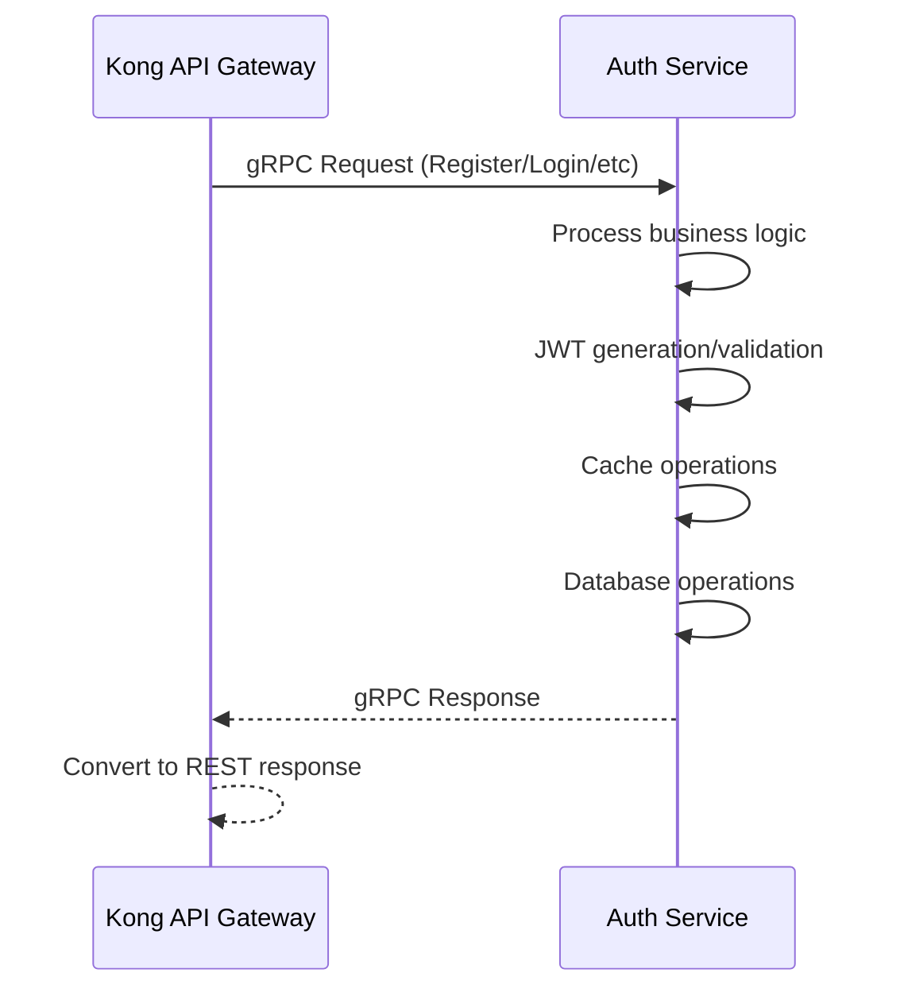

# 🔐 AUTH SERVICE - IMPLEMENTATION PLAN (NO EMAIL VERIFICATION)

## **📝 SIMPLIFIED SECURITY MODEL:**
- **No Permissions**: Only role-based access (USER, ADMIN, MODERATOR)
- **No Salt**: bcrypt handles salting internally (12 rounds)
- **No Account Lockout**: Rely on Kong Gateway rate limiting
- **Immediate Activation**: Users active upon registration

## **🏗️ ARCHITECTURE FOCUS:**
- **Kong API Gateway** → **Auth Service** (gRPC communication)
- Auth Service handles pure authentication business logic
- Kong manages REST-to-gRPC conversion, rate limiting, CORS
- Focus on reactive gRPC service implementation

## **🔄 REQUEST FLOW (SIMPLIFIED):**



## **🎯 SCOPE & REQUIREMENTS**

### **Core Functionalities:**
1. **Register** - User registration (immediate activation, no email verification)
2. **Login** - Authentication with JWT token generation  
3. **Refresh** - JWT token refresh mechanism
4. **ValidateUser** - Token validation and user context
5. **IsUserExist** - Check user existence (for other services)
6. **Logout** - JWT token blacklisting
7. **RoleCheck** - Check user role authorization
8. **RevokeToken** - Revoke specific tokens
9. **ChangePassword** - Update user password
10. **UpdateUserRoles** - Modify user roles (admin function)
11. **UpdateUserProfile** - Update user profile information

### **Technology Stack:**
- **Framework**: Spring Boot 3.2.0 with WebFlux (Reactive)
- **Communication**: gRPC services (no REST controllers)
- **Database**: PostgreSQL with R2DBC (Reactive)
- **Cache**: Redis (for blacklisting and user caching)
- **Security**: JWT with RS256 signing, bcrypt password hashing
- **Integration**: Kong Gateway (REST-to-gRPC conversion)

## **🏗️ DETAILED IMPLEMENTATION PLAN**

### **1. gRPC Service Contracts (Protocol Buffers)**

```protobuf
// auth.proto
service AuthService {
  rpc Register(RegisterRequest) returns (RegisterResponse);
  rpc Login(LoginRequest) returns (LoginResponse);
  rpc RefreshToken(RefreshTokenRequest) returns (RefreshTokenResponse);
  rpc ValidateUser(ValidateUserRequest) returns (ValidateUserResponse);
  rpc IsUserExist(UserExistRequest) returns (UserExistResponse);
  rpc Logout(LogoutRequest) returns (LogoutResponse);
  rpc RoleCheck(RoleCheckRequest) returns (RoleCheckResponse);
  rpc RevokeToken(RevokeTokenRequest) returns (RevokeTokenResponse);
  rpc ChangePassword(ChangePasswordRequest) returns (ChangePasswordResponse);
  rpc UpdateUserRoles(UpdateUserRolesRequest) returns (UpdateUserRolesResponse);
  rpc UpdateUserProfile(UpdateUserProfileRequest) returns (UpdateUserProfileResponse);
}
```

**Key Message Definitions:**
```protobuf
message RegisterRequest {
  string email = 1;
  string username = 2;
  string password = 3;
  string first_name = 4;
  string last_name = 5;
}

message RegisterResponse {
  bool success = 1;
  string user_id = 2;
  string access_token = 3;
  string refresh_token = 4;
  int64 expires_in = 5;
  string message = 6;
}

message LoginRequest {
  string email_or_username = 1;
  string password = 2;
}

message LoginResponse {
  bool success = 1;
  string access_token = 2;
  string refresh_token = 3;
  int64 expires_in = 4;
  UserInfo user_info = 5;
}

message ValidateUserRequest {
  string token = 1;
}

message ValidateUserResponse {
  bool valid = 1;
  string user_id = 2;
  string username = 3;
  string email = 4;
  repeated string roles = 5;
}

message LogoutRequest {
  string access_token = 1;
  string refresh_token = 2;
}

message LogoutResponse {
  bool success = 1;
  string message = 2;
}

message RoleCheckRequest {
  string token = 1;
  string required_role = 2;
}

message RoleCheckResponse {
  bool authorized = 1;
  repeated string user_roles = 2;
}

message RevokeTokenRequest {
  string token = 1;
  string reason = 2;
}

message RevokeTokenResponse {
  bool success = 1;
  string message = 2;
}

message ChangePasswordRequest {
  string user_id = 1;
  string current_password = 2;
  string new_password = 3;
}

message ChangePasswordResponse {
  bool success = 1;
  string message = 2;
}

message UpdateUserRolesRequest {
  string user_id = 1;
  repeated string roles = 2;
  string updated_by = 3;
}

message UpdateUserRolesResponse {
  bool success = 1;
  string message = 2;
}

message UpdateUserProfileRequest {
  string user_id = 1;
  string email = 2;
  string username = 3;
}

message UpdateUserProfileResponse {
  bool success = 1;
  string message = 2;
}
```

### **2. Database Layer (Reactive R2DBC)**

**Core Entities:**
- **AuthUser** - User credentials and basic info (simplified, no salt)
- **RefreshToken** - Long-lived refresh tokens with device tracking
- **UserRole** - User roles (USER, ADMIN, MODERATOR)

**Database Schema:**
```sql
-- auth_users table
CREATE TABLE auth_users (
    user_id UUID PRIMARY KEY DEFAULT gen_random_uuid(),
    email VARCHAR(255) UNIQUE NOT NULL,
    username VARCHAR(100) UNIQUE NOT NULL,
    password_hash VARCHAR(255) NOT NULL,
    account_status VARCHAR(20) DEFAULT 'ACTIVE',
    roles TEXT[] DEFAULT ARRAY['USER'],
    created_at TIMESTAMP DEFAULT CURRENT_TIMESTAMP,
    updated_at TIMESTAMP DEFAULT CURRENT_TIMESTAMP,
    last_login_at TIMESTAMP
);

-- refresh_tokens table
CREATE TABLE refresh_tokens (
    token_id UUID PRIMARY KEY DEFAULT gen_random_uuid(),
    user_id UUID REFERENCES auth_users(user_id) ON DELETE CASCADE,
    token_hash VARCHAR(255) NOT NULL,
    expires_at TIMESTAMP NOT NULL,
    created_at TIMESTAMP DEFAULT CURRENT_TIMESTAMP,
    is_revoked BOOLEAN DEFAULT FALSE,
    device_info JSONB
);
```

**Reactive Repositories:**
- `AuthUserRepository` - User CRUD with custom queries
- `RefreshTokenRepository` - Token management
- Optimized queries for existence checks and validation

### **3. JWT Strategy Implementation**

**Token Architecture:**
- **Access Token**: Short-lived (1 hour), contains user claims and roles
- **Refresh Token**: Long-lived (30 days), used only for token renewal
- **Signing**: RS256 asymmetric encryption with cached public keys
- **Storage**: Stateless - no server-side session storage
- **Blacklist**: Redis-only for logout and revoked tokens

**JWT Claims Structure:**
```json
{
  "sub": "user_id",
  "email": "user@example.com",
  "username": "johndoe",
  "roles": ["USER"],
  "iat": 1234567890,
  "exp": 1234567890,
  "jti": "token_id"
}
```

**Components:**
- `JwtService` - Token generation, validation, and parsing
- `TokenBlacklistService` - Redis-based token revocation
- `SecurityKeyManager` - RSA key pair management
- `TokenCleanupService` - Expired token cleanup

### **4. Inter-Service Communication**

**Auth Service → User Service (Registration Flow):**
```
1. Auth Service validates and saves user to auth_users
2. Auth Service calls User Service via gRPC:
   - CreateUserProfile(user_id, email, username, first_name, last_name)
3. If User Service fails → Rollback auth_users creation
4. If User Service succeeds → Generate JWT tokens and return
```

**gRPC Client Configuration:**
- Service discovery via Kubernetes DNS
- Circuit breaker pattern with Resilience4j
- Retry mechanism for transient failures
- Timeout configuration (10 seconds)

**Kong Gateway Integration Points:**
- `/api/auth/register` → `AuthService.Register`
- `/api/auth/login` → `AuthService.Login`
- `/api/auth/refresh` → `AuthService.RefreshToken`
- `/api/auth/validate` → `AuthService.ValidateUser`
- `/api/auth/logout` → `AuthService.Logout`
- `/api/auth/role-check` → `AuthService.RoleCheck`
- `/api/auth/revoke-token` → `AuthService.RevokeToken`
- `/api/auth/change-password` → `AuthService.ChangePassword`
- `/api/auth/update-roles` → `AuthService.UpdateUserRoles`
- `/api/auth/update-profile` → `AuthService.UpdateUserProfile`

### **5. Reactive Service Implementation Architecture**

**Core Services Structure:**
```java
@GrpcService
public class AuthServiceImpl extends AuthServiceGrpc.AuthServiceImplBase {
    // Register, Login, Refresh, ValidateUser, IsUserExist implementations
}

@Service
public class UserServiceClient {
    // Reactive gRPC client for User Service communication
}

@Service
public class JwtService {
    // JWT generation, validation, and token management
}

@Service
public class CacheService {
    // Redis operations for blacklisting and user caching
}

@Service  
public class RoleService {
    // Role-based authorization and role management
}

@Service
public class TokenBlacklistService {
    // Token revocation and blacklist management
}
```

**Reactive Patterns:**
- Non-blocking database operations with R2DBC
- Reactive Redis operations with ReactiveRedisTemplate
- Parallel token generation and validation
- Error handling with reactive operators (onErrorMap, retry)
- Backpressure handling for high load scenarios

### **6. Security & Performance Features**

**Security Implementation:**
- bcrypt password hashing (12 rounds) - no additional salt needed
- JWT token blacklisting on logout
- Rate limiting (handled by Kong Gateway)
- Input validation and sanitization

**Performance Optimizations:**
- Pre-compiled regex patterns for token validation
- Cached RSA public keys for signature verification
- Connection pooling for database and Redis operations
- Parallel token generation and user lookup operations
- Application Cache (Spring Cache) with Caffeine for hot data (1-5min TTL)
- Redis Cluster for distributed caching

**Monitoring & Metrics:**
- Token validation latency (target: <5ms p95)
- Login success rate monitoring
- Connection pool usage metrics

### **7. Configuration & Dependencies**

**Maven Dependencies:**
```xml
<!-- Core Reactive Stack -->
<dependency>
    <groupId>org.springframework.boot</groupId>
    <artifactId>spring-boot-starter-webflux</artifactId>
</dependency>
<dependency>
    <groupId>org.springframework.boot</groupId>
    <artifactId>spring-boot-starter-data-r2dbc</artifactId>
</dependency>
<dependency>
    <groupId>org.postgresql</groupId>
    <artifactId>r2dbc-postgresql</artifactId>
</dependency>
<dependency>
    <groupId>org.springframework.boot</groupId>
    <artifactId>spring-boot-starter-data-redis-reactive</artifactId>
</dependency>

<!-- gRPC -->
<dependency>
    <groupId>net.devh</groupId>
    <artifactId>grpc-spring-boot-starter</artifactId>
</dependency>

<!-- JWT & Security -->
<dependency>
    <groupId>com.auth0</groupId>
    <artifactId>java-jwt</artifactId>
</dependency>
<dependency>
    <groupId>org.springframework.security</groupId>
    <artifactId>spring-security-crypto</artifactId>
</dependency>

<!-- Caching -->
<dependency>
    <groupId>org.springframework.boot</groupId>
    <artifactId>spring-boot-starter-cache</artifactId>
</dependency>
<dependency>
    <groupId>com.github.ben-manes.caffeine</groupId>
    <artifactId>caffeine</artifactId>
</dependency>

<!-- Platform Contracts -->
<dependency>
    <groupId>com.platform</groupId>
    <artifactId>platform-contracts</artifactId>
    <version>1.0.0</version>
</dependency>

<!-- Resilience -->
<dependency>
    <groupId>io.github.resilience4j</groupId>
    <artifactId>resilience4j-spring-boot3</artifactId>
</dependency>
```

**Environment Configuration:**
```yaml
# Database
spring.r2dbc.url: r2dbc:postgresql://postgres:5432/auth_db
spring.r2dbc.username: auth_user
spring.r2dbc.password: ${POSTGRES_PASSWORD}

# Redis
spring.data.redis.host: redis
spring.data.redis.port: 6379
spring.data.redis.password: ${REDIS_PASSWORD}

# gRPC
grpc.server.port: 9090
grpc.client.user-service.address: static://user-service:9090

# JWT
jwt.access-token-ttl: 3600
jwt.refresh-token-ttl: 2592000
jwt.private-key-path: /secrets/jwt-private.key
jwt.public-key-path: /secrets/jwt-public.key

# Caching Configuration
spring.cache.type: caffeine
spring.cache.caffeine.spec: maximumSize=10000,expireAfterWrite=300s
```

## **🔄 SIMPLIFIED REGISTRATION FLOW**

```
1. Frontend → Kong Gateway (REST POST /api/auth/register)
     ↓
2. Kong → Auth Service (gRPC Register call)
     ↓
3. Auth Service:
   - Validate input (email, username, password strength)
   - Check if user already exists (email/username)
   - Hash password with bcrypt (no additional salt needed)
   - Save user to auth_users table (account_status = ACTIVE)
     ↓
4. Auth Service → User Service (gRPC CreateUserProfile)
   - Pass: user_id, email, username, first_name, last_name
     ↓
5. If User Service succeeds:
   - Generate JWT access token (1h) + refresh token (30d)
   - Cache user data in Redis
   - Return tokens to client
     ↓
6. If User Service fails:
   - Rollback: Delete auth_users record
   - Return registration error
```

## **🔑 LOGIN FLOW**

```
1. Frontend → Kong Gateway (REST POST /api/auth/login)
     ↓
2. Kong → Auth Service (gRPC Login call)
     ↓
3. Auth Service:
   - Find user by email or username
   - Verify password with bcrypt
   - Check account status (active)
     ↓
4. Generate tokens:
   - Create JWT access token with user claims
   - Create refresh token and store in database
   - Cache user data in Redis (5-min TTL)
   - Update last_login_at timestamp
     ↓
5. Return tokens and user info to Kong → Frontend
```

## **🔄 TOKEN REFRESH FLOW**

```
1. Client → Kong → Auth Service (ValidateUser with refresh token)
     ↓
2. Auth Service:
   - Parse refresh token JWT
   - Check if token exists in database (not revoked)
   - Verify token signature and expiration
   - Check if user account is still active
     ↓
3. Generate new tokens:
   - Create new access token (1h)
   - Create new refresh token (30d)
   - Revoke old refresh token in database
   - Update Redis cache
     ↓
4. Return new token pair
```

## **✅ TOKEN VALIDATION FLOW**

```
1. Any Service → Auth Service (gRPC ValidateUser)
     ↓
2. Auth Service:
   - Parse JWT access token
   - Verify signature with public key
   - Check token expiration
   - Check Redis blacklist for revoked tokens
   - Return user context (id, email, username, roles)
     ↓
3. Performance target: <5ms response time, 5000+ req/sec
```

## **🔐 LOGOUT FLOW**

```
1. Client → Kong → Auth Service (gRPC Logout)
     ↓
2. Auth Service:
   - Parse access and refresh tokens
   - Add both tokens to Redis blacklist
   - Set TTL based on token expiration
   - Clear user cache entries
     ↓
3. Return logout success
```

## **🛡️ ROLE CHECK FLOW**

```
1. Service → Auth Service (gRPC RoleCheck)
     ↓
2. Auth Service:
   - Validate token
   - Extract user roles from JWT
   - Check if required role exists
   - Return authorization decision
```

## **🔒 CHANGE PASSWORD FLOW**

```
1. Client → Kong → Auth Service (gRPC ChangePassword)
     ↓
2. Auth Service:
   - Validate current password
   - Hash new password with bcrypt
   - Update password in database
   - Invalidate all user tokens (add to blacklist)
   - Return success
```

## **📋 PROJECT STRUCTURE**

```
auth-service/
├── src/main/java/com/platform/auth/
│   ├── AuthServiceApplication.java
│   ├── grpc/
│   │   ├── AuthServiceImpl.java              # Main gRPC service
│   │   └── GlobalGrpcExceptionHandler.java   # Error handling
│   ├── service/
│   │   ├── JwtService.java                   # JWT operations
│   │   ├── UserServiceClient.java            # User Service gRPC client
│   │   ├── CacheService.java                 # Redis operations
│   │   ├── TokenBlacklistService.java        # Token revocation
│   │   ├── RoleService.java                  # Role management and checks
│   │   ├── PasswordService.java              # Password operations
│   │   └── SecurityKeyManager.java           # RSA key management
│   ├── repository/
│   │   ├── AuthUserRepository.java           # R2DBC repository
│   │   └── RefreshTokenRepository.java       # Token repository
│   ├── entity/
│   │   ├── AuthUser.java                     # User entity
│   │   └── RefreshToken.java                 # Token entity
│   ├── dto/
│   │   └── mapper/
│   │       ├── AuthUserMapper.java           # Entity-DTO mapping
│   │       └── TokenMapper.java
│   ├── config/
│   │   ├── DatabaseConfig.java               # R2DBC configuration
│   │   ├── RedisConfig.java                  # Redis configuration
│   │   ├── CacheConfig.java                  # Caffeine cache configuration
│   │   ├── GrpcClientConfig.java             # gRPC client setup
│   │   ├── SecurityConfig.java               # Security configuration
│   │   └── ResilienceConfig.java             # Circuit breaker config
│   ├── exception/
│   │   ├── AuthException.java                # Custom exceptions
│   │   ├── UserAlreadyExistsException.java
│   │   ├── InvalidCredentialsException.java
│   │   └── TokenException.java
│   └── util/
│       ├── PasswordValidator.java            # Password strength validation
│       └── TokenUtils.java                   # Token utilities
├── src/main/proto/
│   └── auth.proto                            # gRPC service contract
├── src/main/resources/
│   ├── application.yml                       # Configuration
│   ├── application-dev.yml                   # Dev environment
│   ├── application-prod.yml                  # Production environment
│   └── db/migration/
│       ├── V1__Create_auth_users_table.sql
│       └── V2__Create_refresh_tokens_table.sql
└── k8s/
    ├── deployment.yaml                       # Kubernetes deployment
    ├── service.yaml                          # Kubernetes service
    ├── configmap.yaml                        # Configuration
    └── secrets.yaml                          # JWT keys and passwords
```

## **🤝 DEPENDENCIES & INTEGRATION REQUIREMENTS**

### **Kong Gateway Configuration Needed:**
1. **Service Registration**: Register Auth Service gRPC endpoint
2. **Route Configuration**: Map REST endpoints to gRPC methods
3. **Plugin Configuration**: 
   - gRPC-Gateway plugin for REST-to-gRPC conversion
   - Rate limiting plugin
   - CORS plugin
4. **Error Handling**: gRPC status code to HTTP status code mapping

### **Platform Contracts Integration:**
1. **User Service Contracts**: Include UserServiceGrpc stubs
2. **Auth Service Contracts**: Publish auth.proto to platform-contracts
3. **Version Management**: Ensure backward compatibility

### **Infrastructure Dependencies:**
1. **PostgreSQL Database**: auth_db database with proper user permissions
2. **Redis Instance**: For token blacklisting and user caching
3. **JWT Key Pair**: RSA private/public keys for token signing
4. **User Service**: Must be available for profile creation during registration

## **🚀 PERFORMANCE TARGETS**

- **Token Validation**: <5ms p95 latency, 5000+ req/sec throughput
- **Login Operations**: <100ms p95 latency, 1000+ req/sec throughput
- **Registration**: <500ms p95 latency (includes User Service call)
- **Memory Usage**: <1GB heap under normal load
- **Connection Pools**: R2DBC (20-50), Redis (20-30)

### **🗄️ CACHING STRATEGY**

**Application Cache (Caffeine):**
```
user_profile_cache:{userId} → User profile data (5 min TTL)
user_roles_cache:{userId} → User roles (5 min TTL)  
rsa_public_key_cache → Cached RSA public keys (1 hour TTL)
```

**Redis Distributed Cache:**
```
# Token Blacklisting
blacklist:access:{jti} → "revoked" (TTL: token expiration)
blacklist:refresh:{jti} → "revoked" (TTL: token expiration)

# User Sessions
user_sessions:{userId} → Active session data (TTL: 1 hour)

# Rate Limiting Support
rate_limit:{userId} → Request count (TTL: per window)
```

## **🧪 TESTING STRATEGY**

### **Unit Tests:**
- JWT service operations
- Password validation and hashing
- Repository operations with TestContainers
- Service layer business logic

### **Integration Tests:**
- gRPC service endpoints
- Database operations with test containers
- Redis operations
- User Service client communication

### **Performance Tests:**
- Token validation load testing
- Login flow performance testing
- Database connection pool testing

## **📦 DEPLOYMENT CONFIGURATION**

### **Docker Configuration:**
- Multi-stage build for optimized image size
- Non-root user for security
- Health checks for container readiness
- JVM tuning for containerized environment

### **Kubernetes Configuration:**
- Resource requests and limits
- Horizontal Pod Autoscaler (HPA)
- Service mesh integration (if applicable)
- Configuration via ConfigMaps and Secrets
- Liveness and readiness probes

This implementation plan provides a comprehensive roadmap for building the Auth Service without email verification, focusing on immediate user activation and seamless integration with the existing microservices architecture.